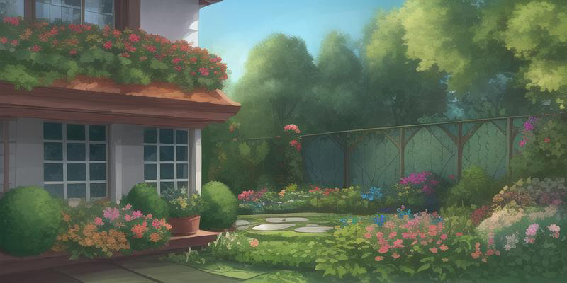

# polygon-img
##use golang to crop an image to polygon

### Notice: 
the point area must be **clockwise** 

### Hot to get
```go get github.com/dangwan/polygon```

### test case
```
func main(){
    f, _ := os.Open("garden.jpeg")
    img, _, _ := image.Decode(f)
        c := polygon.Polygon{
        Width:  img.Bounds().Dx(),
        Height: img.Bounds().Dy(),
        Area: []polygon.Point{
            {200, 0},
            {600, 300},
            {100, 350},
            {0, 100},
        },
    }
    rgbaImg, _ := polygon.ClipForPolygon(&c, img)
}
```

### result show
#### before

#### after crop:

